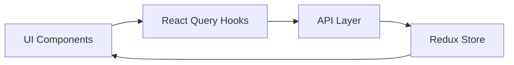

# Ideall To Do App Documentation

## Table of Contents


- [Overview](#overview)

- [Project Structure](#project-structure)

- [Tech Stack](#tech-stack)

- [Setup & Installation](#setup--installation)

- [Code Style & Conventions](#code-style--conventions)

- [Key Features](#key-features)

- [Architecture](#architecture)


## Overview
A Next.js-based todo application with TypeScript, featuring task management capabilities, Material-UI integration, and Redux state management.


## Project Structure
```
src/
├── config/
│   └── interceptors.ts         # Axios configuration and interceptors
├── data/
│   ├── repository/            # API integration layer
│   │   └── api/              # API endpoints and hooks
│   └── types/                # TypeScript type definitions
├── services/
│   └── store/               # Redux store configuration
│       └── slices/         # Redux slices
├── ui/
│   ├── components/         # Reusable UI components
│   ├── layouts/           # Layout components
│   ├── screens/          # Page-level components
│   ├── styles/          # Global styles
│   └── theme/          # MUI theme configuration
└── pages/             # Next.js pages
```

## Tech Stack

- Next.js 15.1.6

- TypeScript

- Material-UI (MUI) v6

- Redux Toolkit

- React Query (TanStack Query)

- Formik & Yup

- Axios


## Setup & Installation

1. Install dependencies:
```bash
npm install
```

2. Set up environment variables:
```env
NEXT_PUBLIC_API_URL=your_api_url
```

3. Run development server:
```bash
npm run dev
```

## Code Style & Conventions


### Component Structure

Components follow a consistent structure:
```
import { FC } from 'react'
import { styled } from '@mui/material'

interface IComponentProps {
  // Props interface
}

export const Component: FC<IComponentProps> = ({ props }) => {
  return (
    // JSX
  )
}
```

### Styling

The project uses MUI's styled API with Emotion:

```
import { styled } from '@mui/material'

export const MainLayoutContainer = styled("div")({
    display: "flex",
    justifyContent: "center",
    width: "100vw",
    height: "100vh",
    background: "#D6D7DE"
})
```

### API Integration

API calls are organized using React Query hooks:

```
export const useGetAllTasks = () => {
    return useQuery<AxiosResponse<APIResponse<Task[]>, Error>>({
        queryKey: ["task", "allTasks"],
        queryFn: getAllTasksFetch,
    });
};
```
## Key Features

### 1. Task Management
- Create, update, and delete tasks
- Task categorization (All, Open, Closed, Archived)
- Date-based task filtering (Today/Tomorrow)

### 2. State Management
- Redux for global state management
- React Query for server state management
- Centralized store configuration

### 3. Theme Customization
Custom MUI theme with:
- Typography system
- Color palette
- Component style overrides

## Architecture

### 1. Data Flow


### 2. Component Hierarchy
- MainLayout
  - TodoWrapper
    - TaskList
      - TaskCard
    - TaskForm
    - StatisticBox

### 3. API Integration
The application uses a custom Axios instance with interceptors for:
- Error handling
- Response formatting
- Toast notifications


## Contributing
1. Follow the established folder structure
2. Use TypeScript for all new components
3. Implement proper type definitions
4. Follow the existing component patterns
5. Use MUI's styled API for styling

## Build & Deployment
```bash
# Build
npm run build

# Start production server
npm run start
```

This documentation provides an overview of the project's structure, conventions, and key features. For more detailed information about specific components or features, refer to the inline documentation in the source code.